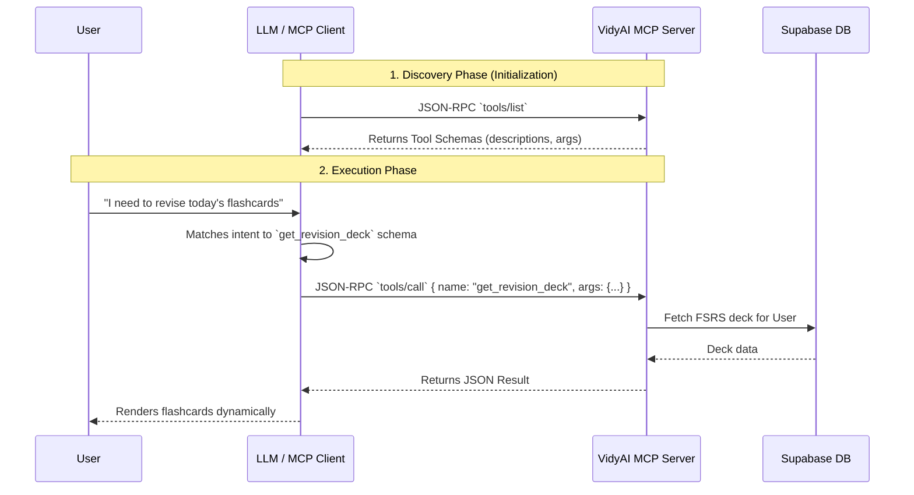
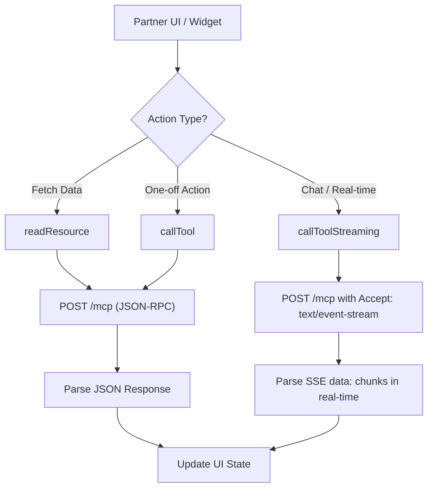

# VidyAI Model Context Protocol (MCP) Architecture

This document provides a detailed, developer-level explanation of the Model Context Protocol (MCP) and its implementation within the VidyAI platform.

## What is MCP?

The **Model Context Protocol (MCP)** is an open standard designed by Anthropic. It provides a universal, secure, and standardized way to connect AI models with external data sources, APIs, and tools. Instead of creating custom REST integrations for every new feature, MCP standardizes interactions into a unified JSON-RPC 2.0 protocol using three core primitives:

1. **Tools**: Actions that the AI (or a client) can execute to perform tasks or mutate state.
2. **Resources**: Read-only data sources mapped to URIs that provide context to the AI.
3. **Prompts**: Parameterized templates used to standardize interactions and LLM outputs.

## How the Model Knows Which Tool to Call

One of the most powerful features of MCP is **Tool Discovery**. 
When an MCP Client (like an LLM application or an embedded SDK) connects to the VidyAI MCP Server, it first sends a `tools/list` request. 
The server responds with a JSON Schema outlining every available tool, its description, and its expected arguments (e.g., student_id, exam_type, etc.). 

The LLM (e.g., Claude 3.5 Sonnet) reads these descriptions. When a user asks a question like "Can you grade my test?", the LLM inherently understands—based on the schema it pulled during initialization—that it should invoke the `submit_mcq_answers` tool. The LLM instructs the client by constructing the JSON arguments, and the client sends the `tools/call` request to the server.



---

## 1. Backend Implementation (FastAPI + FastMCP)

The backend server is built using the `fastmcp` Python library and is mounted within the FastAPI application.

- **File Location:** `services/api/routers/mcp.py`
- **Endpoint:** `/mcp`
- **Transport:** HTTP POST for standard JSON-RPC requests, and Server-Sent Events (SSE) for real-time streaming responses.

### Authentication & Usage Metering
Every request made to the MCP server must include a Bearer token (`<partner_api_key>`).
- **Validation (`_auth_partner`)**: The server checks the `partner_api_keys` and `partner_organizations` tables in Supabase to verify that the partner is active and the API key is valid.
- **Quota Management**: It ensures the partner has not exceeded their `monthly_call_limit`.
- **Metering (`record_usage`)**: The latency, token usage, and HTTP status of every tool call are logged into the `partner_api_usage` table for billing and analytics.

### Identity Mapping
Partners integrate VidyAI using their own internal User IDs. The backend resolves these external IDs to internal VidyAI UUIDs dynamically:
- **Resolver (`_resolve_student`)**: Maps external IDs via the `partner_student_mappings` table, ensuring strict data isolation and seamless integration without requiring partners to sync their user databases.

### Exposed Capabilities

#### Tools (Actions)
Tools wrap VidyAI's internal services to allow partners to trigger actions.
- `solve_doubt`: Invokes the RAG pipeline to answer student questions based on NCERT materials.
- `get_revision_deck`: Retrieves due flashcards based on the FSRS spaced repetition algorithm.
- `submit_revision_result`: Records student performance on a flashcard and computes the next review interval.
- `get_study_plan`: Generates or retrieves a daily personalized study plan.
- `run_mcq_test` / `submit_mcq_answers`: Manages adaptive and practice MCQ sessions.
- `process_video` / `get_video_status`: Dispatches and polls Celery background tasks for video processing.

#### Resources (Data Context)
Resources expose read-only contextual data using a custom URI scheme.
- `vidyai://syllabus/{exam_type}`: Returns a full hierarchical tree of subjects, chapters, and concepts.
- `vidyai://student/{student_id}/profile`: Fetches metadata like exam targets, current study streaks, etc.
- `vidyai://student/{student_id}/knowledge-graph`: Returns detailed mastery states and FSRS variables.

---

## 2. Sample JSON-RPC Requests

Because MCP operates on JSON-RPC 2.0, all communication follows a strict request/response pattern. 

### Example 1: Calling a Tool
The client wants to fetch the revision deck for a specific student.

**Client Request (`POST /mcp`)**
```json
{
  "jsonrpc": "2.0",
  "id": "req_123",
  "method": "tools/call",
  "params": {
    "name": "get_revision_deck",
    "arguments": {
      "student_id": "ext_student_999",
      "exam_type": "JEE",
      "limit": 20
    }
  }
}
```

**Server Response**
```json
{
  "jsonrpc": "2.0",
  "id": "req_123",
  "result": {
    "cards": [
      {
        "concept_id": "abc-123",
        "concept_name": "Newton's Laws of Motion",
        "mastery_score": 85,
        "days_overdue": 1
      }
    ],
    "total_due": 1,
    "estimated_minutes": 5
  }
}
```

### Example 2: Reading a Resource
The client wants to load the student's mastery profile.

**Client Request (`POST /mcp`)**
```json
{
  "jsonrpc": "2.0",
  "id": "req_124",
  "method": "resources/read",
  "params": {
    "uri": "vidyai://student/ext_student_999/profile"
  }
}
```

**Server Response**
```json
{
  "jsonrpc": "2.0",
  "id": "req_124",
  "result": {
    "contents": [
      {
        "uri": "vidyai://student/ext_student_999/profile",
        "mimeType": "application/json",
        "text": "{\"student_id\": \"ext_student_999\", \"profile\": {\"streak_count\": 12}, \"mastery_summary\": {\"mastered\": 15}}"
      }
    ]
  }
}
```

---

## 3. Frontend Implementation (Embed SDK)

The frontend client provided to partners acts as the JSON-RPC 2.0 consumer for the MCP backend.

- **File Location:** `packages/embed-sdk/src/transport.ts`

### Client Transport Layer Workflow



The SDK handles the complexities of JSON-RPC protocol formatting and token management:

1. **Standard Execution (`callTool`)**:
   Formats arguments, sends an HTTP POST, and parses the resulting JSON. Used for rapid actions like submitting answers or fetching flashcards.

2. **Real-time Streaming (`callToolStreaming`)**:
   Essential for conversational AI features like the AI Tutor.
   - It sends a POST request with the `Accept: text/event-stream` header.
   - Uses the browser's native `TextDecoder` and `ReadableStream` to parse the Server-Sent Events (SSE).
   - Reads `data:` chunks line-by-line, triggering an `onChunk` callback for intermediate text rendering (typing effect).

3. **Resource Retrieval (`readResource`)**:
   Invokes the `resources/read` JSON-RPC method to fetch the contextual data schemas provided by the backend resources.
